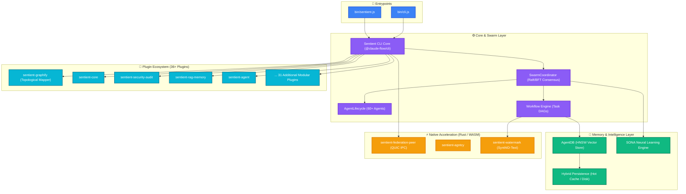
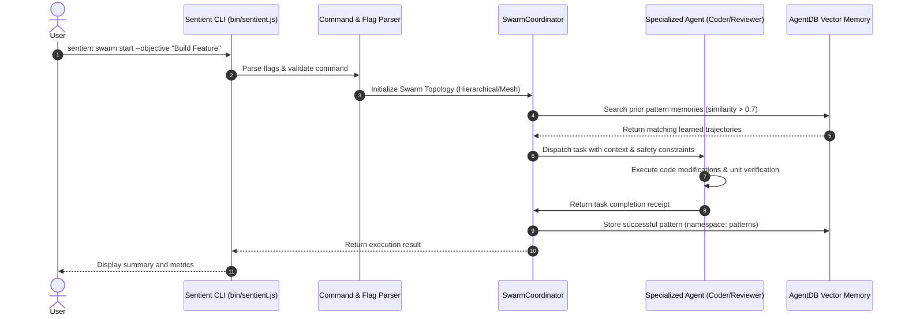
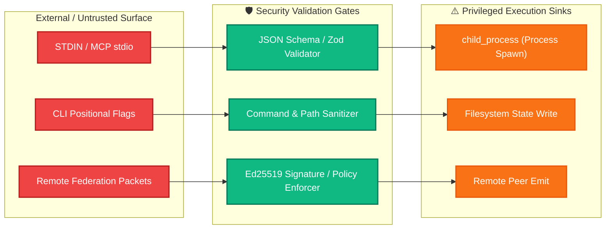

# Sentient: Whole-Project Architecture & Topology Graph

> **Repository**: [DeepxkJadhav/Sentient](https://github.com/DeepxkJadhav/Sentient)  
> **Author**: Deepxk Jadhav  
> **Generated By**: `sentient-graphify` engine  
> **Metrics**: 53 Nodes · 53 Directed Relationships · 36+ Extensible Plugins

---

## 1. High-Level Architecture Topology

The Sentient platform is organized as a layered reactive multi-agent system:

---

## 2. Runtime Logic & Execution Flow

How a command travels through the verification and execution pipeline:

---

## 3. Security Boundary & Attack Surface

Sentient isolates untrusted external input with strict validation gates before allowing access to privileged system sinks:

---

## 4. Subsystem Catalog Summary

| Subsystem | Node Count | Description |
|-----------|------------|-------------|
| **Entrypoints** | 2 | Zero-dependency CLI entry wrappers |
| **Core & Swarm** | 3 | Swarm coordinator, consensus engines, task DAG runner |
| **Memory & AI** | 3 | AgentDB HNSW vector index, SONA neural learning |
| **Plugins** | 41 | Modular feature packages for Claude Code & Codex |
| **Native Accelerators** | 3 | Rust crates for QUIC federation and SynthID watermarking |

---

*Generated automatically with `node plugins/sentient-graphify/scripts/graphify.mjs`*.
